# Window10-Linux Ubuntu remote control environment

Windows10 -> Linux ubuntu remote-control environment installation guide for Machine-Learning Beginner

Chungnam university undergraduate research student Dae-Young Song (2020.07.14.)

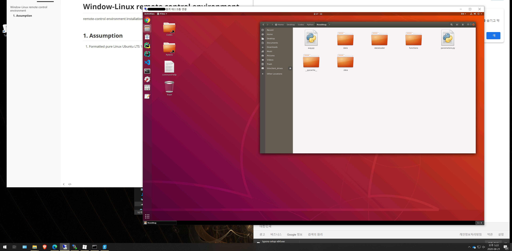


## 1. Assumption

1. Formatted pure Linux Ubuntu LTS 18.04 Desktop *(Bionic-beaver)*
2. Control PC: Windows 10


## 2. Windows10 -> Linux ubuntu 18.04 Remote Access

 The following guide doesn't support xfce4 GUI, but does Ubuntu's own GUI.

- Make sure the internet is available!

- open terminal and type

  - ```sudo apt update```

- before OS upgrade,
  
  - we are going to upgrade Linux os, but if the error that cannot read the address appears (could not resolve), take the following actions.
  
  - software & updates -> Download from: [change here!] << main server
    
  - 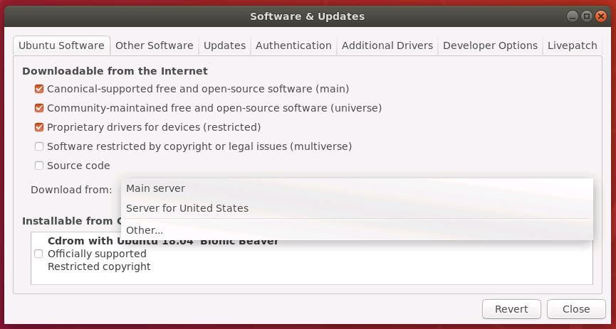
    
  - ```sudo gedit /etc/resolv.conf```
    
  - comment out existing sentences.
    
  - type following sentences.
    
  - ```
    - nameserver 8.8.8.8
    - nameserver 8.8.4.4
    ```
    
  - 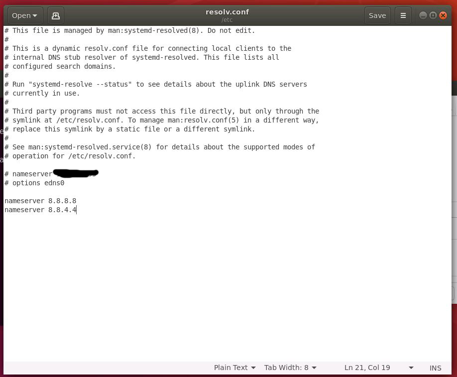
  
  - save.
    
  - retype -> ```sudo apt update```
  
- OS upgrade
  
  - ```
    sudo apt dist-upgrade   # upgrade your computer. 
    ```
    
  - ```
    sudo ufw allow 3389/tcp  # xrdp port setting
    ```
  
- reboot your computer.

- xrdp installation

type following commands in your terminal in order.

```
- sudo apt install xserver-xorg-core

- sudo apt install xserver-xorg-input-all
  -> keyboard and mouse don't work if you reboot without this package [xserver-xorg-input-all]

- sudo apt install xorgxrdp

- sudo apt install xrdp

- insert [45-allow-colord.pkla] file in '/etc/polkit-1/localauthority/50-locad.d/~' path.

- sudo apt install net-tools	# software for checking network

- sudo service --status-all | grep
  -> [+] xrdp  <=== check!

- sudo netstat -antp
  -> 3389 port <=== check!
```

​		reboot.


- Access
  - caution: Windows 10 remote desktop connection cannot be accessed if the Linux Ubuntu user account is logged in. One of them must be logged out. There is no need to separate the monitor from the hardware.

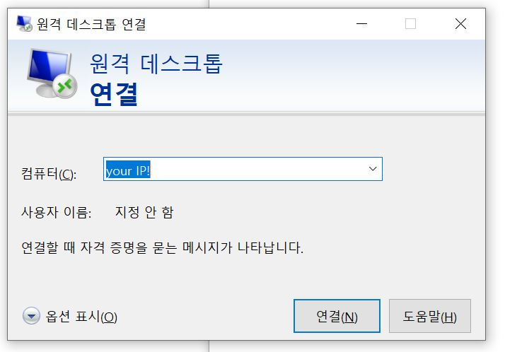

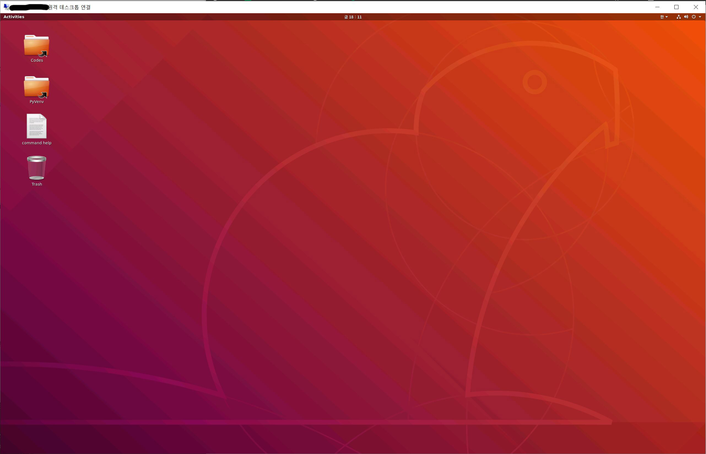

- More
  
  - never type following sentences in your terminal.
  
    - ```
      sudo apt install gnome-panel
      
      echo “gnome-session —session=gnome-fallback” > ~/.xsession
      
      sudo /etc/init.d/xrdp restart
      ```
  
    - we don't use xfce4 GUI.
  
  - entering TTY
  
    - On the login screen, press ctrl+alt+F1~F6.
  
  - getting out of infinite ubuntu login bug caused by xRDP
  
    - enter the TTY environment.
  
    - log in.
  
    - type next command. replace {username} as appropriate.
  
    - ```
      sudo chown {username}:{username} -R /home/{username}
      
      sudo reboot
      ```
  
    - infinite login bug can also be caused by a graphics card driver error.
  
  - Gnome Tweaks
  
    - install [Gnome Tweaks]
    - 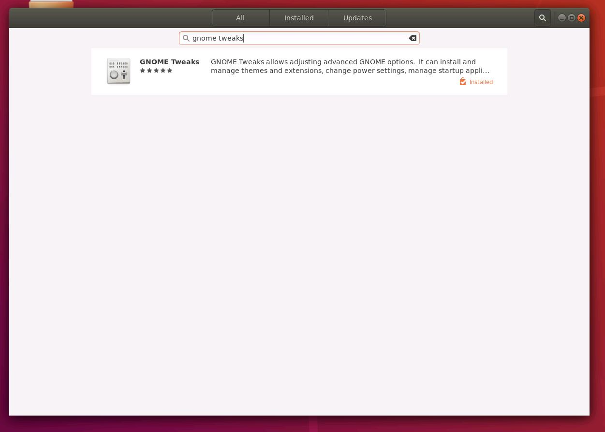
    - in terminal, type ```sudo apt install gnome-shell-extensions```
    - ```sudo reboot```
    - set your GUI interface.
    - 
  


## 3. GPU Driver Installation Guide

### 1. disable nouveau

- sudo gedit /etc/modprobe.d/blacklist-nouveau.conf

  - type sentences

    ```
    blacklist nouveau
    
    options nouveau modeset=0
    ```

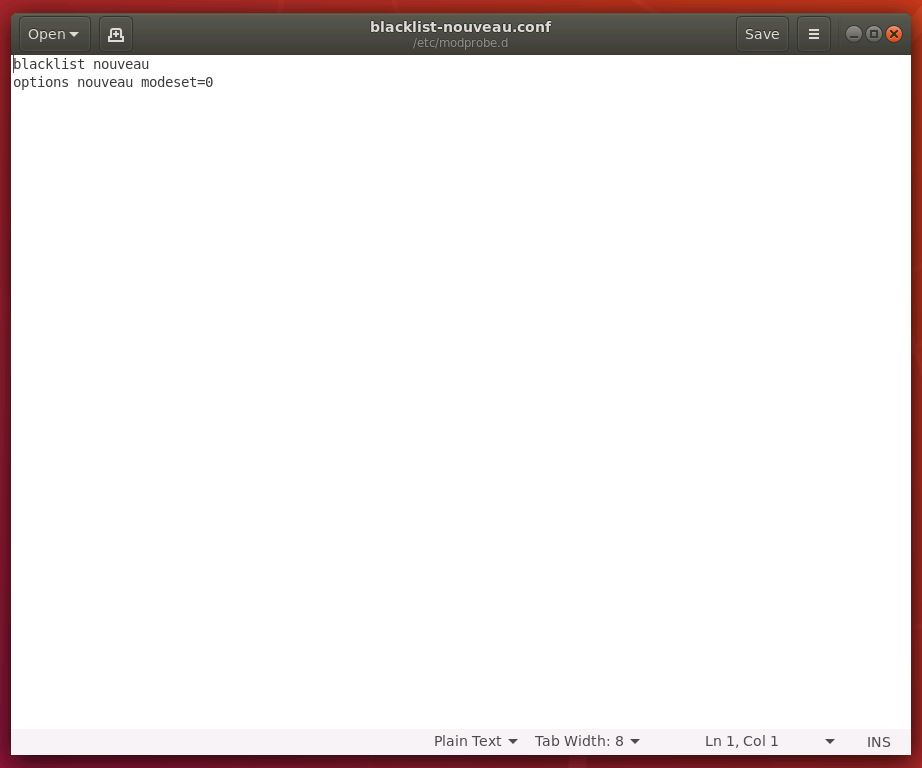

- ```
  - sudo update-initramfs -u	# policy update
  
  - sudo reboot
  ```

- watch the screen resolution change.

### 2. driver installation

you can choose other methods besides following two methods.

1. ```
   (automatic installation)
   
   sudo add-apt-repository ppa:graphics-drivers/ppa
   
   sudo apt update
   
   sudo ubuntu-drivers autoinstall 
   ```

2. ```
   (manual installation)
   
   sudo ubuntu-drivers devices
   
   sudo apt install nvidia-driver-{number} 
   ```

- ```sudo reboot```

- watch the screen resolution change.

- in terminal, type ```nvidia-smi```:

  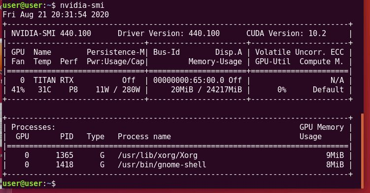


## 4. CUDA & cuDNN

### 1. CUDA installation

- check the relationship between the version of the GPU driver you installed and CUDA version that supports it.

- google the checked CUDA and install it with the command provided on the Nvidia Developer official site.

- example:

  

  

### 2. cuDNN installation

- google cuDNN, log in to Nvidia Developer and install cuDNN that supports the CUDA version you have installed. download [Runtime Library], [Developer Library], [Code samples and User Guide] as deb files, and access the downloaded directory in the terminal.

- ```sudo dpkg -i {filename.deb} 	# runtime -> developer -> code sample```

- after installation, we can check if cuDNN is properly installed. following commands:

  ---

  - replace 'v7' with the version you installed.

  - ```
    cp -r /usr/src/cudnn_samples_v7/ $HOME	# copy
    
    cd $HOME/cudnn_samples_v7/mnistCUDNN	# access to the address
    
    make clean && make	# compile
    
    ./mnistCUDNN	# run
    ```

  - if you changed gcc version from 7 to another, you can choose the version by typing next command,

    ```sudo update-alternatives --config gcc```

  ---

- when both CUDA and cuDNN are installed, register environment variables. if you register with 'export' commands on the terminal, it disappears after rebooting.

- ``` sudo gedit ~/.bashrc```

- add the following commands at the bottom of the file and save it.

  ```
  export PATH =/usr/local/cuda-10.2/bin${PATH:+:${PATH}}
  
  export LD_LIBRARY_PATH=/usr/local/cuda-10.2/lib64${LD_LIBRARY_PATH:+:${LD_LIBRARY_PATH}}
  ```

  and reboot.

- now, environment variables are automatically set during booting.

- you can check environment variables registration with the commands:

  ```nvcc -V```

  

  

## 5. GCC

I referenced https://linuxize.com/post/how-to-install-gcc-compiler-on-ubuntu-18-04/ 

- ```
  - sudo apt update
  - sudo apt install build-essential
  - sudo apt install manpages-dev
  - gcc --version    # version check
  - sudo apt install software-properties-common
  - sudo add-apt-repository ppa:ubuntu-toolchain-r/test
  - sudo apt install gcc-7 g++-7 gcc-8 g++-8 gcc-9 g++-9 # install the versions you want.
  
  - version weighting commands:
    > sudo update-alternatives --install /usr/bin/gcc gcc /usr/bin/gcc-9 90 --slave /usr/bin/g++ g++     /usr/bin/g++-9 --slave /usr/bin/gcov gcov /usr/bin/gcov-9
    > sudo update-alternatives --install /usr/bin/gcc gcc /usr/bin/gcc-8 80 --slave /usr/bin/g++ g++     /usr/bin/g++-8 --slave /usr/bin/gcov gcov /usr/bin/gcov-8
    > sudo update-alternatives --install /usr/bin/gcc gcc /usr/bin/gcc-7 70 --slave /usr/bin/g++ g++     /usr/bin/g++-7 --slave /usr/bin/gcov gcov /usr/bin/gcov-7
    > sudo update-alternatives --config gcc
  ```


## 6. Windows - Linux Ubuntu Data Trade

WinSCP software provides GUI for data trade between Windows 10 and Linux Ubuntu.

https://winscp.net/eng/download.php

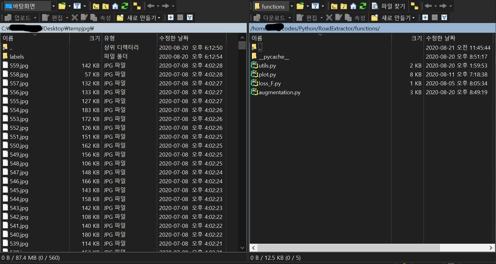

- on the Linux desktop, type:

  ```sudo apt install ssh```

  and reboot.

- SFTP protocol customarily uses port 22, and as a result of experiments, there is no need for a separate firewall configuration on Ubuntu.

- now, on the Windows 10 desktop, install WinSCP and access through the program.

- if you need root permission, follow next actions (This can be dangerous).

- on the Linux, type:

  - ```
    sudo gedit /etc/ssh/sshd_config
    ```

  - and change PermitRootLogin {XXX -> yes}

  - ```
    PermitRootLogin yes
    ```

- in terminal, type: ```service sshd restart```

- ```sudo passwd root```

- set password of root ID

- if you edit the files using root ID, you will not be able to edit those files through your normal user ID. (permission problem)

## 7. Linux Ubuntu root Login

This part can be dangerous.

- ```
  sudo passwd root	# set root ID password.
  ```

- ```
  sudo gedit /etc/gdm3/custom.conf
  ```

  - write the sentences under the [security] section.
  
  - ```
    AllowRoot=true
    ```
  
- ```
  sudo gedit /etc/pam.d/gdm-password
  ```

  - and comment out this:
  
  - ```
    auth    required   pam_succeed_if.so user != root quiet
    ```
  
- now, you can access root ID.

- Warning message removal actions

- ```
  sudo gedit /root/.profile
  ```

  - and comment out this:
  
  - ```
    mesg n || true
    ```
  


## 8. Python3 Virtual Environment

python users isolate their programs to manage library dependencies.

if you like anaconda or pipenv, you can choice them. I wrote this part based on the 'venv'

```
sudo apt install python3
sudo apt install python3-pip
sudo pip3 install pip --upgrade
sudo apt install python3-venv
```

- choose a directory for you to use.
-  example: in my case, folder name: PyVenv

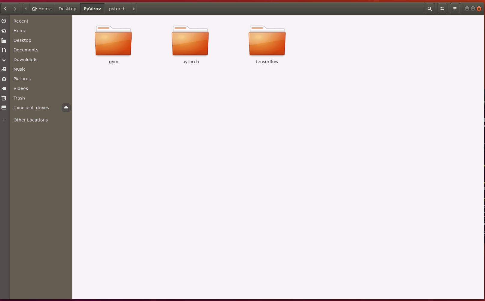

- in terminal, access env directory and type:

  ```
  python3 -m venv {environment_name}
  ```

- and you can activate virtual-environment by:

  ```
  source ./{environment_name}/bin/activate
  ```

- and you can check whether it is activated or not. see (environment_name)

- 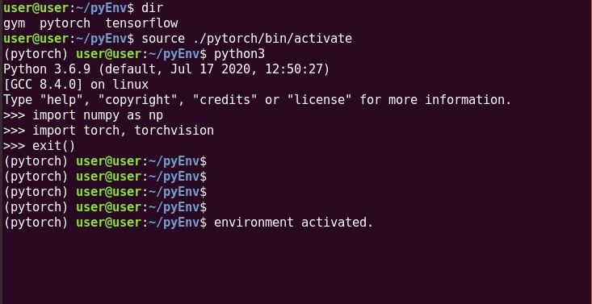

- deactivate command:

  ```
  deactivate
  ```

- now, you can separate the libraries that should be separated from the libraries to be used in common across Linux account.

- outside in virtual environments, commonly used library installation commands:

  ```
  sudo pip3 install {package_name}
  ```

- in virtual environment, you can install:

  ```
  pip3 install {package_name}
  ```


## 9. Ubuntu Terminal Command Help

sudo: super-user do, means administrator permission

su : substitute-user

root ID : admin ID

apt-get: package installation

apt-cache: package search

apt: a linux package management program that takes the features of apt-get and apt-cache into one.

- ```
  apt install {Package}
  ```

   => install {Package}.

- ```
  apt remove {Package}
  ```

  => uninstall {Package}. except for user setting files.

- ```
  apt purge {Package}
  ```

  => uninstall {Package}. including user setting files.

- ```
  apt update
  ```

  => load package index to upgrade.

- ```
  apt upgrade
  ```

  => upgrade package updated with the command 'update'.

- ```
  apt dist-upgrade
  ```

  => upgrade package checking dependency. install all necessary dependencies.

- ```
  apt autoremove
  ```

  => uninstall useless packages.

- ```
  ln -s {original_dir} {link_name}
  ```

  => make symbolic link.


## 10. Pip3 command Help

- ```
  pip3 list
  ```

  => list the package names installed in the current environment.

- ```
  pip3 freeze > /home/user/Desktop/list.txt
  ```

  => write down all installed package names and save them as 'list.txt'

- ```
  pip3 list -o
  ```

  => list packages that need to be updated.

- ```
  pip3 install {Package}
  ```

  => install {Package}.

- ```
  pip3 uninstall {Package}
  ```

  => uninstall {Package}.

- ```
  pip3 install pip --upgrade
  ```

  => upgrade Linux pip3.

- ```
  python -m pip install --upgrade pip
  ```

  => upgrade Windows pip.

- ```
  pip3 install {Package} --upgrade
  ```

  => upgrade {Package} to latest version.

- ```
  pip3 install {Package}=={version}
  ```

  => install a specific version of the {Package}
